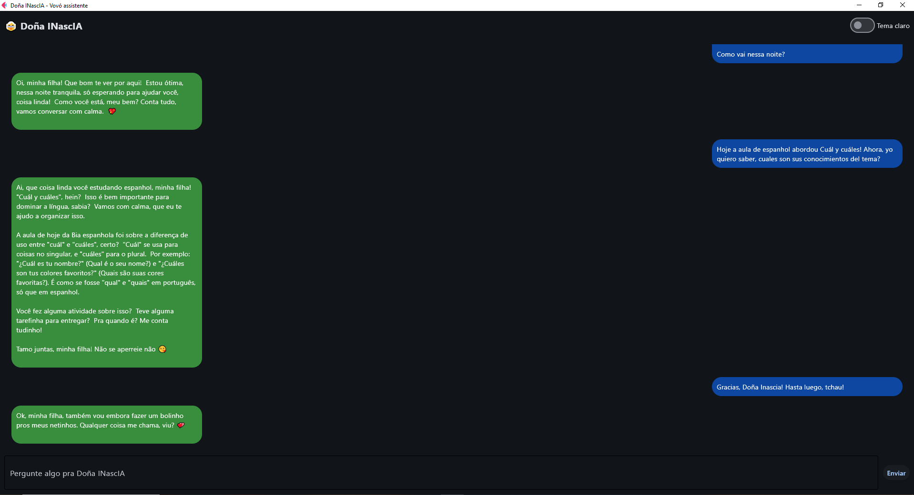

# 👵 Doña INascIA – Inteligência Artificial da Terceira Idade

Doña INascIA é uma inteligência artificial carismática, fofa e espirituosa — feita para ajudar nos estudos com carinho, bom humor e sabedoria de vó. Ela entende de provas, projetos, cronogramas e programação, tudo isso com um jeitinho acolhedor e personalizado. 💬✨

---

## 💡 Propósito do projeto

Esse projeto foi criado com o objetivo de:

- Aplicar na prática o uso de **LLMs (Large Language Models)** via API
- Aprender sobre integração entre **frontend (Flet)** e **IA generativa**
- Criar uma experiência **interativa, leve e divertida** para estudos e auto-organização
- Explorar como personalizar IAs com **personalidade e contexto**

---

## 🎯 O que a Doña INascIA faz?

- Recebe perguntas em linguagem natural (ex: “Oi Dona INascIA, tive aula de genética mendeliana hoje!”)
- Gera resumos personalizados com incentivo emocional e estrutura didática
- Atua como uma assistente de estudos com tom acolhedor e funcional
- Suporta múltiplas categorias como:
  - Faculdade (provas, matérias, aulas)
  - Angular, Python, JavaScript, ReactJS (estudos e projetos)
  - Inglês e Espanhol (tarefas, entregas e revisões)

---

## 🚀 Resultado

---

## 👩‍🍳 Sobre o nome

**INascIA** é uma brincadeira com o meu nome (_Ingrid do Nascimento_) + IA.  
E o “Doña” veio pra dar o toque carinhoso de uma vó e o acento veio porque é assim que se escreve em espanhol que é uma lingua que amo. 

---

## 🗒️ Observações

> Esse projeto foi feito com fins de aprendizado, demonstração de domínio técnico e criatividade na personalização de LLMs.

Para mais detalhes técnicos ou colaboração futura, entre em contato diretamente.

---

## 📫 Contato
https://www.linkedin.com/in/ingrid-do-nascimento-porf%C3%ADrio-115612243/
iporfirio.bio@gmail.com
